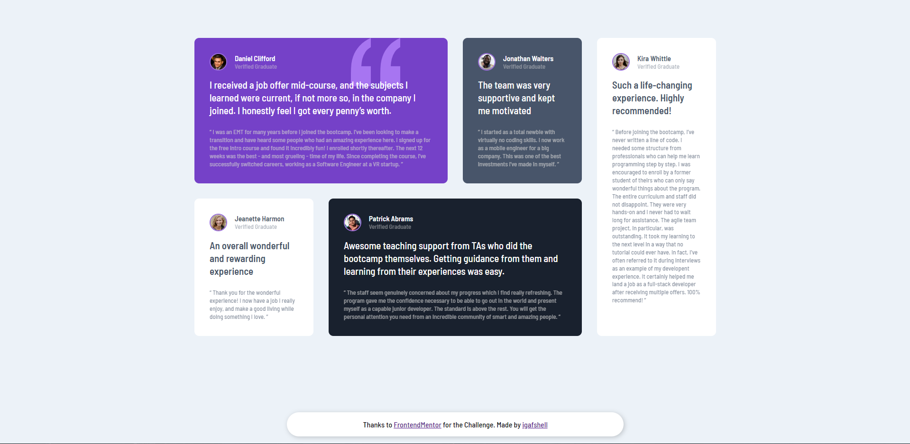

# Frontend Mentor - Testimonials grid section solution

This is a solution to the [Testimonials grid section challenge on Frontend Mentor](https://www.frontendmentor.io/challenges/testimonials-grid-section-Nnw6J7Un7). Frontend Mentor challenges help you improve your coding skills by building realistic projects.

## Table of contents

- [Overview](#overview)
  - [Screenshot](#screenshot)
  - [Links](#links)
- [My process](#my-process)
  - [Built with](#built-with)
  - [What I learned](#what-i-learned)
  - [Continued development](#continued-development)
  - [Useful resources](#useful-resources)
- [Author](#author)
- [Acknowledgments](#acknowledgments)

**Note: Delete this note and update the table of contents based on what sections you keep.**

## Overview

### Screenshot



### Links

- Live Site URL: [Here](https://igafshell.github.io/testimonials-grid-section/)

## My process

I started with thinking how to structure and style the component. Then I proceeded with writing the code.
I started with the html. The structure of a card consists of a header, which consists of the client image and a `<div>` with the client name and "Verified Graduate", the lead text and the text in quotes.
After the html I started writing the css. I didn't use any frameworks or modules, just flexbox, grid and basic css. I had a bit of trouble with the colours, but it turned out fine. I knew how to work with grid, so the layout was easy to do. And to make it fit on small screens, I used a media query with some grid magic.
Well, that's about it, it was a pretty tough and challenging project for me, but it turned out well.

### Built with

- Semantic HTML5 markup
- Basic CSS attributes
- Flexbox
- CSS Grid

### What I learned

I learned how to use:

- Grid CSS
- Media Queries
- Box-shadow Attribute

Also, I am proud of this CSS:

```
main {
	display: grid;
	grid-template-columns: repeat(4, 1fr);
	grid-template-areas:
		"purple purple gray-blue white-2"
		"white-1 dark-blue dark-blue white-2";

	max-width: 1100px;
	gap: 2rem;
	margin: auto;
}
```

### Continued development

I will keep honing my frontend and web design skills on frontendmentor.com and learn how to use flexbox, grid, box-shadow *(I really don't understand how this one works)* and css in general.

### Useful resources

- [Box-shadow](https://www.w3schools.com/cssref/css3_pr_box-shadow.asp) - This page really helped me out with box-shadow

## Author

- Frontend Mentor - [@igafshell](https://www.frontendmentor.io/profile/yourusername)

## Acknowledgments

I want to thank [Frontend Mentor](https://www.frontendmentor.io/challenges) for this awesome challenge! I really enjoyed the process!
